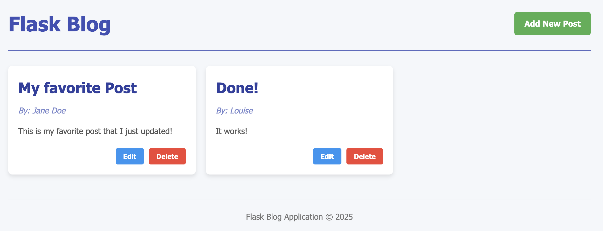

# Flask Blog Application

This is a simple blog application built using Flask, where users can add, update, and delete blog posts. The posts are stored in a JSON file.



## Features
- View all blog posts on the homepage
- Add new blog posts
- Update existing posts
- Delete posts
- JSON file storage for persistence

## Installation
### Prerequisites
Ensure you have Python installed (version 3.x recommended).

### Clone the Repository
```bash
git clone https://github.com/yourusername/flask-blog.git
cd flask-blog
```

### Install Dependencies
Create a virtual environment (optional but recommended):
```bash
python -m venv venv
source venv/bin/activate  # On Windows use: venv\Scripts\activate
```
Install the required packages:
```bash
pip install flask
```

## Usage
### Run the Application
```bash
python app.py
```
The application will start at `http://127.0.0.1:5001/`.

## Project Structure
```
flask-blog/
│-- storage/
│   └── posts.json  # JSON file to store posts
│-- templates/
│   ├── index.html  # Homepage template
│   ├── add.html  # Add post template
│   ├── update.html  # Update post template
│-- app.py  # Main application file
│-- README.md  # This file
```

## API Routes
### Homepage
**`GET /`** - Displays all blog posts.

### Add a Post
**`GET /add`** - Displays the form to add a post.
**`POST /add`** - Adds a new post.

### Update a Post
**`GET /update/<post_id>`** - Displays the form to edit a post.
**`POST /update/<post_id>`** - Updates the post.

### Delete a Post
**`POST /delete/<post_id>`** - Deletes the specified post.

## Notes
- The `posts.json` file is created automatically if it does not exist.
- Ensure the `storage/` directory exists or the app will create it automatically.

## License
This project is licensed under the MIT License.

## Author
Your Name - [GitHub](https://github.com/yourusername)

